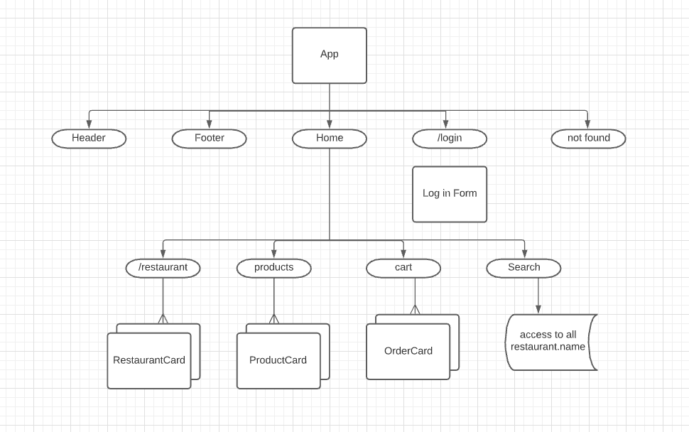

# Mod 5 Project
## Foodies Road 

Foodies Road is a web application for food services created with React.Js in the frontend and Ruby on Rails as API in the backend that allows users to order food online.

Users can navigate the application without having to log in, they can browse through the differents restaurants, choose restaurants based on the ones closes to the location provided in the search bar, or make use of the google map to search restaurants based on their locations. 
Once the user is logged in, they will have more access to do more things such as leave a review, place orders, and update their account. 

## Features
Serializers
Building linear direction on the relationships and model association in the backend
CRUD operations along models

Users can:
Log into the application
Create an update accounts.
Browse all the products as and filter them by cuisines, by drinks, root dishes, specialities, etc.
Create and delete reviews
Add products to their cart
Update their cart by removing items
Log out
Make use of the google map
Search closes locations based on the provided address.

## Active Record Associations
There are 6 models that have the following associations has_many, belongs_to and has_many, through:

### Domain Model

### Component Tree

### Original Wireframe

## Tech Stack
Ruby on Rails
Rails as an API
JSON Web Tokens and localStorage
Zomato API
Google API
GeoLocation API
Stripe API
PostgreSQL
Customed CSS
Active Record
Semantics-UI
rack-cors
active_model_serializers

### Build Status
Deployed
Futute features will come soon

### Next Steps
Update user information
Allow users to upload a profile picture
Incorporate validations

## Visit a deploy version here 
<a href='https://evening-taiga-01396.herokuapp.com/' >Foodies Road</a>

### Acknowledgements
I  would like to thank:
Eric Kim
Sylwia Vargas
Annie Zheng
Isabel K. Lee
the Code Bender Cohort
